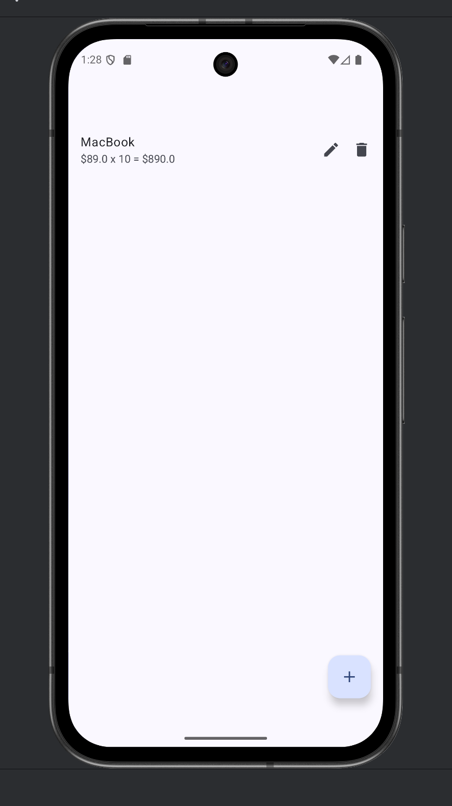
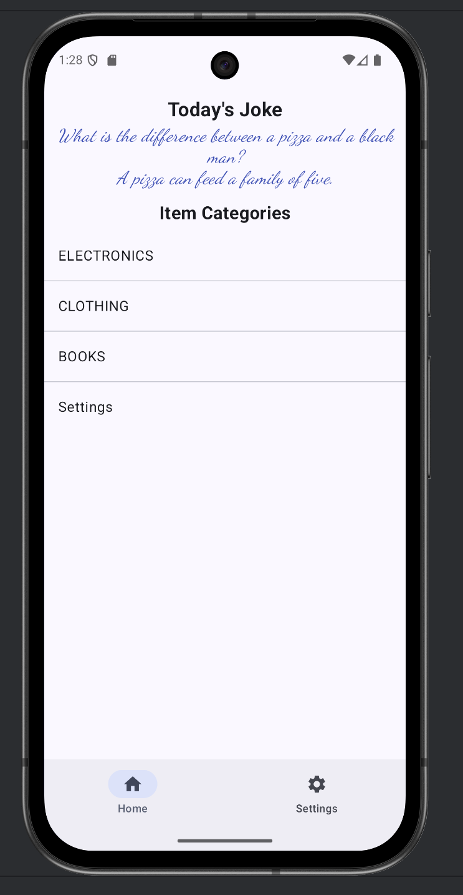
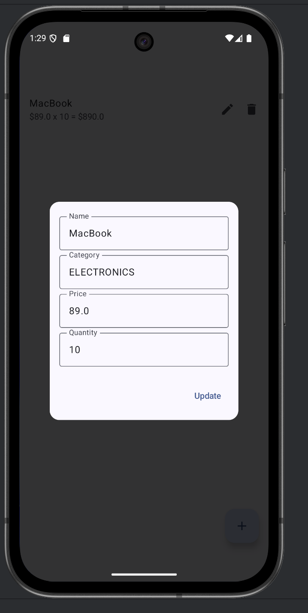
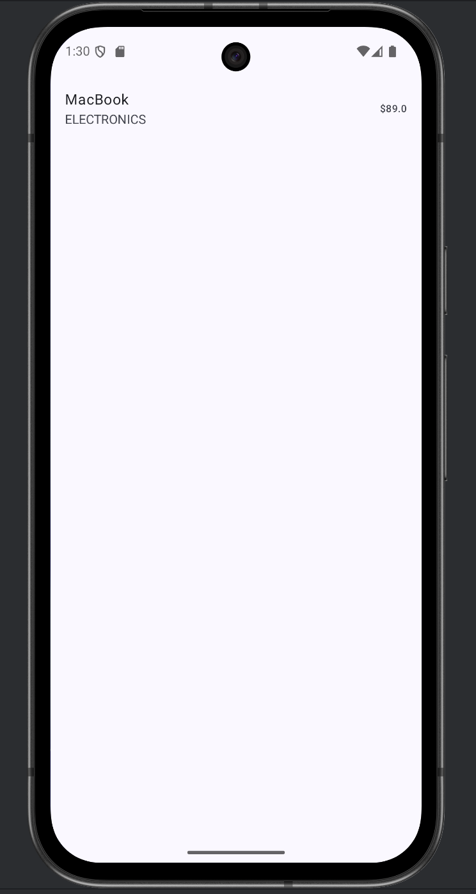

# Inventory Management App

## Overview
This is a single-activity Android application for inventory management, featuring persistent storage, auto-login, navigation, and background joke fetching using WorkManager and Retrofit.

## Features
- **Persistent Storage:** Uses Room Database for item and category data.
- **Auto-login:** Persists user login state using DataStore.
- **Navigation:** Implements all screens (Login, Home, ItemList, ProductDetail, Settings) in a single activity using the NavDisplay API.
- **Bottom Navigation:** Visible on Home and Settings screens, hidden on Login.
- **Background Joke Fetching:** Uses WorkManager and Retrofit to fetch a random joke from [JokeAPI](https://sv443.net/jokeapi/v2/joke/Any) every 30 minutes and displays it on the Home screen.

## Screenshots

### App Running





## Project Structure
```
app/src/main/java/com/example/inventorymgmt/
├── core/
│   ├── database/         # Room database, DAOs, entities
│   ├── network/          # ApiProvider for Retrofit
│   └── worker/           # JokeWorker for background joke fetching
├── feature/
│   ├── data/             # Remote API and DTOs
│   ├── home/             # Home screen, state, and viewmodels
│   ├── item/             # Item list, detail, and CRUD logic
│   ├── login/            # Login screen, state, and viewmodels
│   └── productdetail/    # Product detail screen and state
├── nav/                  # Navigation graph and keys
├── ui/                   # Theme and UI components
└── MainActivity.kt       # App entry point
```

## Key Implementation Details

### 1. Joke API Integration
- **ApiProvider.kt:**
  - Sets up Retrofit with base URL `https://sv443.net/jokeapi/v2/`.
  - Provides `JokeApiService` for API calls.
- **JokeApiService.kt:**
  - Defines `@GET("joke/Any") suspend fun getJoke(): JokeResponse`.
- **JokeResponse.kt:**
  - Data class supports both "single" and "twopart" joke types:
    ```kotlin
    data class JokeResponse(
        val error: Boolean,
        val type: String,
        val joke: String?,
        val setup: String?,
        val delivery: String?
    )
    ```

### 2. Background Joke Fetching
- **JokeWorker.kt:**
  - Uses `runBlocking` to call the suspend API function in `doWork()`.
  - Handles both joke types and outputs the joke string to WorkManager.
- **WorkerViewModel.kt:**
  - Schedules the worker to run every 30 minutes.
  - Observes worker state and exposes the latest joke to the UI.
  - Provides `fetchJokeNow()` to fetch a joke immediately on app launch.
- **HomeScreen.kt:**
  - Calls `fetchJokeNow()` in `LaunchedEffect` to display a joke immediately.
  - Observes `workerState` to update the joke every 30 minutes.

### 3. Navigation
- **AppNavGraph.kt & AppNavKey.kt:**
  - Implements navigation for Login, Home, ItemList, ProductDetail, and Settings screens.
  - Bottom navigation bar is shown only on Home and Settings.

### 4. Auto-login
- **DataStoreExt.kt & LoginViewModel.kt:**
  - Persists and checks login state using DataStore.
  - Navigates to Home if the user is already logged in.

### 5. Inventory CRUD
- **ItemRepositoryImpl.kt, CreateItemViewModel.kt, ItemListViewModel.kt:**
  - Supports adding, editing, and deleting items using Room.

## How It Works
1. **App Launch:**
   - HomeScreen fetches a joke immediately and displays it.
   - WorkManager schedules JokeWorker to update the joke every 30 minutes.
2. **Login:**
   - User credentials are persisted; auto-login is supported.
3. **Navigation:**
   - All screens are managed in a single activity with proper navigation keys.
4. **Inventory:**
   - Users can add, edit, and delete items, with changes persisted in Room.

## API Reference
- [JokeAPI Documentation](https://sv443.net/jokeapi/v2/)

## Setup & Requirements
- Android Studio
- Kotlin
- Room, DataStore, Retrofit, WorkManager
- Internet permission in `AndroidManifest.xml`:
  ```xml
  <uses-permission android:name="android.permission.INTERNET" />
  ```

## Notes
- The joke is fetched immediately on app launch and then updated every 30 minutes in the background.
- The app is designed for rubric compliance with navigation, auto-login, persistent storage, and background tasks.

## License
MIT

